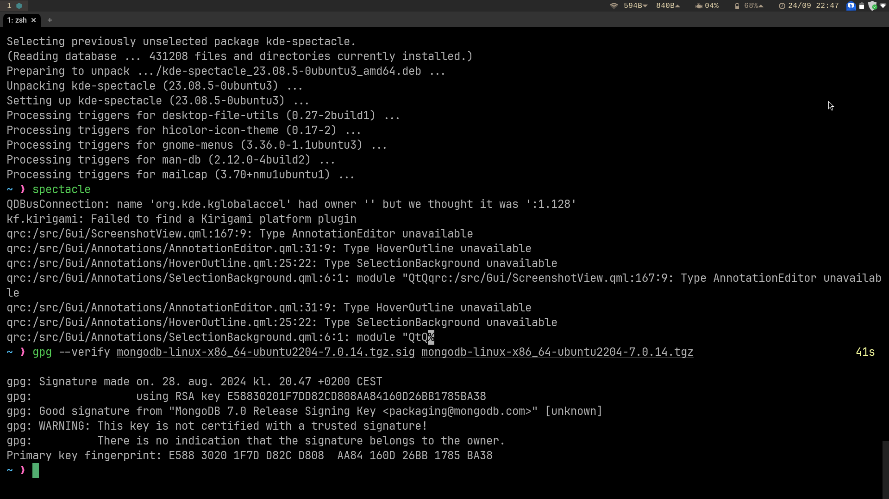
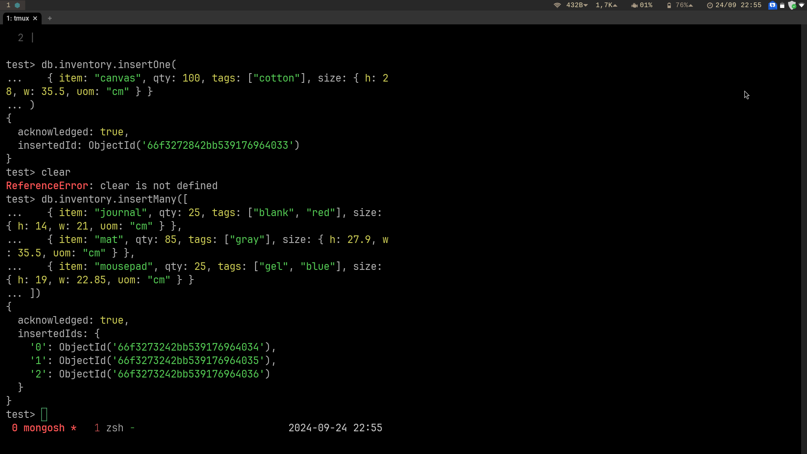
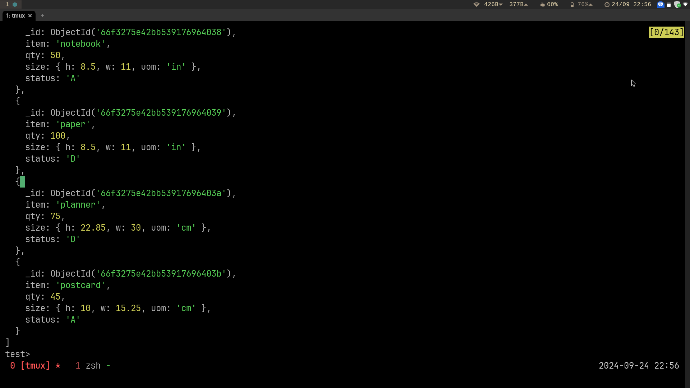
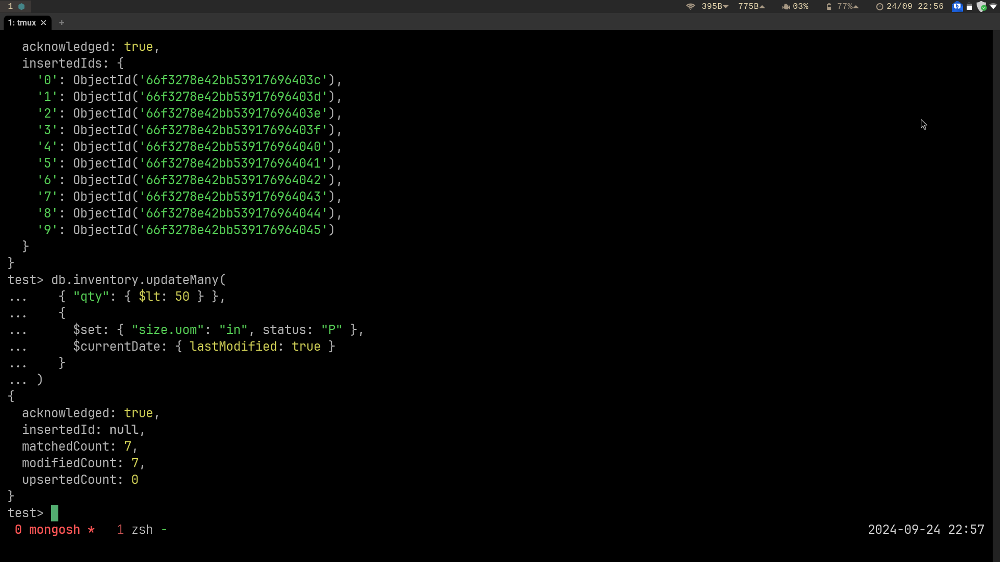
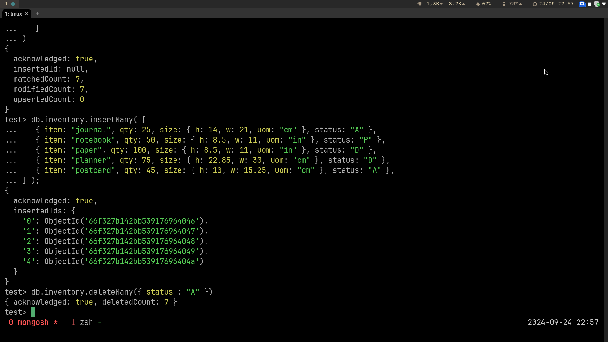
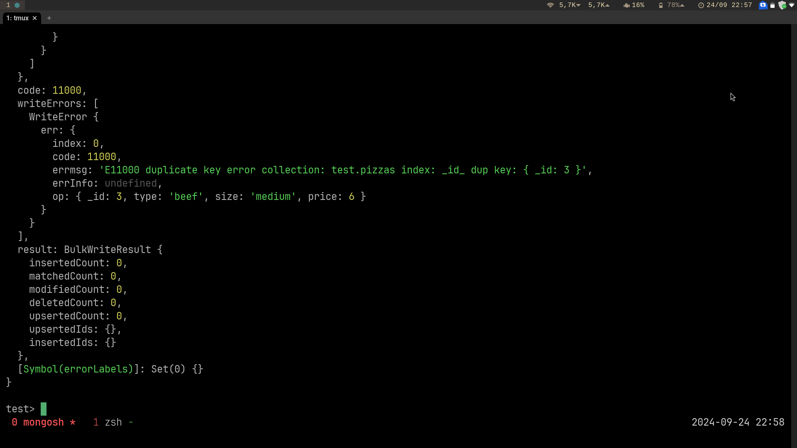
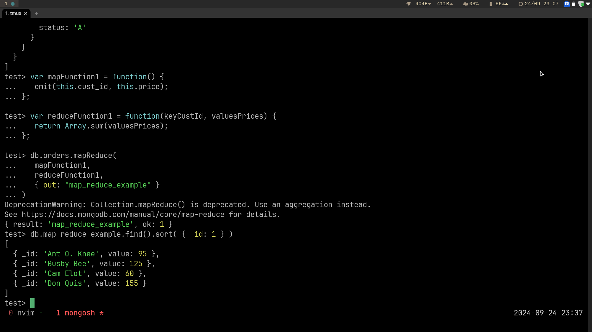
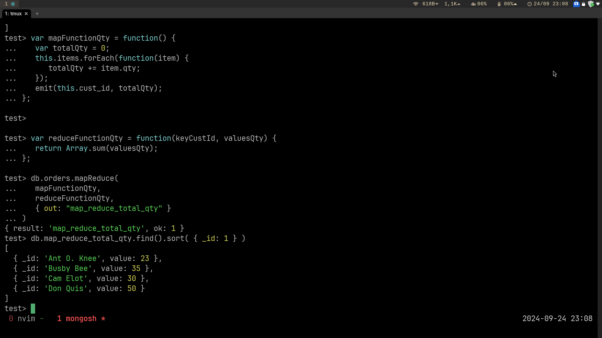

# Assignment 5 monogDB

## Verification of package

## Experiment 1

### Insert section

### Query section

### Update section

### Remove section

### Bulk write section

## Expirement 2

### Map-reduce intro:

### My function

This function is useful because it allows us to see the quantity of items ordered by
each customer, this allows us to track customer demand, inventory management and so on.

The collection obtained contains id of a user and the number of items ordered by the 
customer

